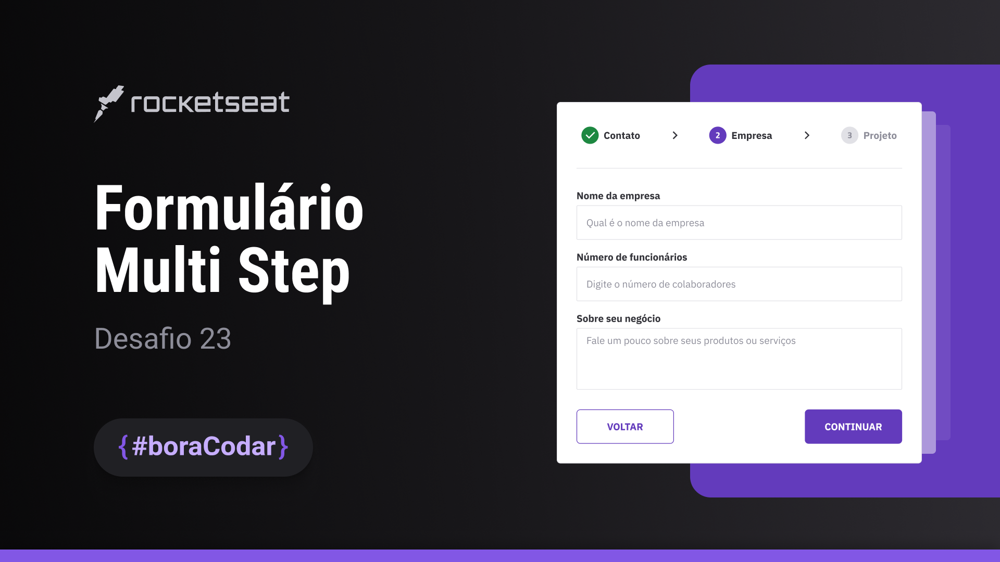

<h1 align="center">Formulário multi steps</h1>

  <a href="#-tecnologias">Tecnologias</a>&nbsp;&nbsp;&nbsp;|&nbsp;&nbsp;&nbsp;
  <a href="#-tecnologias">Design</a>&nbsp;&nbsp;&nbsp;|&nbsp;&nbsp;&nbsp;
  <a href="#-layout">Layout</a>&nbsp;&nbsp;&nbsp;|&nbsp;&nbsp;&nbsp;
  <a href="#memo-licença">Licença</a>

  

 

Projeto de um formulário com 3 níveis, com slide entre os níveis.

 
  
  <a href="https://lvdamaceno.github.io/boracodar/desafio23-form-multi-step/index.html">Acesse o projeto</a>

## 🚀 Tecnologias

Esse projeto foi desenvolvido com as seguintes tecnologias:

- HTML e CSS
- Javascript
- Phosporicons
- Git e Github
- Figma

## 📐 Design

- Desktop
- Mobile

## 🔖 Layout

Você pode visualizar o layout do projeto através [DESSE LINK](<https://www.figma.com/file/Du4Im7A7BKmn8pDcq7rzRa/Formul%C3%A1rio-Multi-Step--%E2%80%A2-Desafio-23-(Community)?type=design&t=871y6A3tYMP3pXme-6>). É necessário ter conta no [Figma](https://figma.com) para acessá-lo.

## :memo: Licença

Esse projeto está sob a licença MIT.

---

By Vinícius Damaceno :wave: [Entre em contato](https://about.lvdamaceno.dev)
