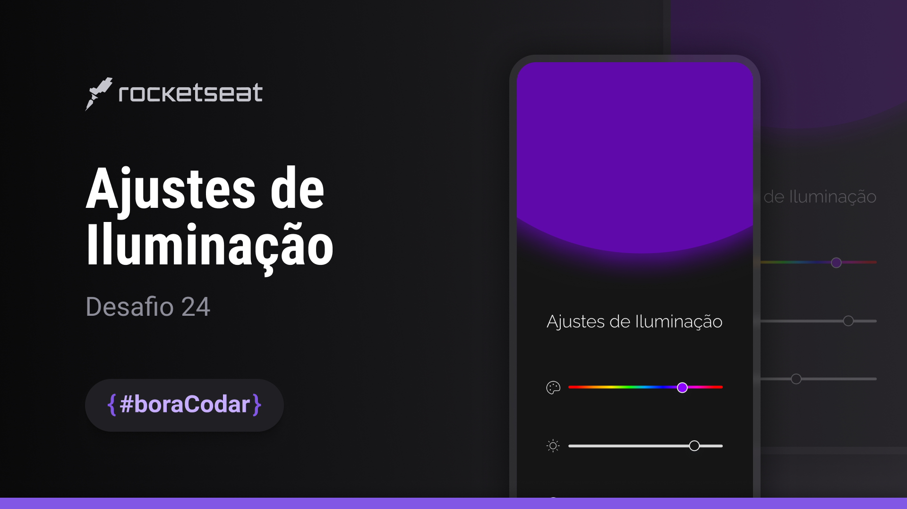

<h1 align="center">Ajuste de Iluminação</h1>

  <a href="#-tecnologias">Tecnologias</a>&nbsp;&nbsp;&nbsp;|&nbsp;&nbsp;&nbsp;
  <a href="#-tecnologias">Design</a>&nbsp;&nbsp;&nbsp;|&nbsp;&nbsp;&nbsp;
  <a href="#-layout">Layout</a>&nbsp;&nbsp;&nbsp;|&nbsp;&nbsp;&nbsp;
  <a href="#memo-licença">Licença</a>

  

 

Projeto de um componente de ajuste de cor, iluminação e saturação usando sliders e mostrando uma lista de opções, sendo hsl, rgb e hexa.

 
  
  <a href="https://lvdamaceno.github.io/boracodar/desafio24-color-light/index.html">Acesse o projeto</a>

## 🚀 Tecnologias

Esse projeto foi desenvolvido com as seguintes tecnologias:

- HTML e CSS
- Javascript
- Phosporicons
- Git e Github
- Figma

## 📐 Design

- Desktop
- Mobile

## 🔖 Layout

Você pode visualizar o layout do projeto através [DESSE LINK](<https://www.figma.com/file/fkRiH1CdBqvQ1OYKs2Icyq/Ajustes-de-Ilumina%C3%A7%C3%A3o-(Community)?type=design&node-id=707%3A66&t=p9MAoE4GtdJ2hS3l-1>). É necessário ter conta no [Figma](https://figma.com) para acessá-lo.

## :memo: Licença

Esse projeto está sob a licença MIT.

---

By Vinícius Damaceno :wave: [Entre em contato](https://about.lvdamaceno.dev)
